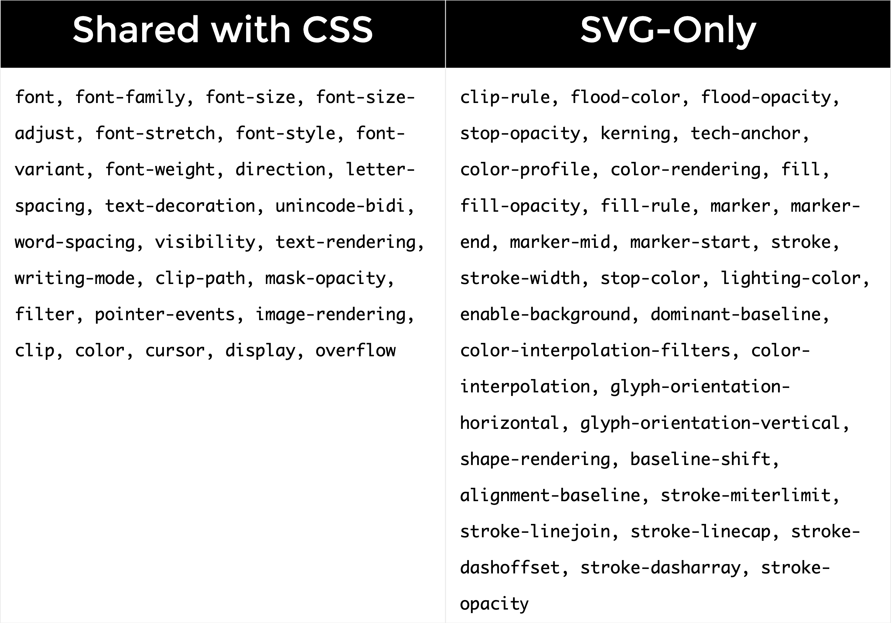

这是 [A Guide to SVG Animations (SMIL)](https://css-tricks.com/guide-svg-animations-smil/#aa-specifying-the-target-of-the-animation-with-xlinkhref) 的部分内容2。


[[toc]]


## 4️⃣ ⭐ `xlink:href` 指定动画目标

无论你使用4种动画元素（`<animate>` & `<set>` & `<animateMotion>` & `animateColor`）中的哪一种，你都需要指定动画的目标。

为了指定目标，你可以使用 `xlink:href` 特性。该属性接受一个指向此动画目标元素的URI引用，该元素将随着时间的推移而被修改。

::: warning

目标元素必须是当前SVG文档片段的一部分。

:::


```html {2}
<rect id="cool_shape" ...="">
	<animate xlink:href="#cool_shape" ...=""></animate>
</rect>
```

如果你使用嵌套的语法，也可以忽略 `xlink:href`，它会直接寻找当前动画元素的父元素，即上面可写为：`<animate>动画元素也会对父元素 <rect> 进行动画`

```js {2}
<rect id="cool_shape" ...="">
  <!-- 嵌套的形式可以省略 xlink:href -->
	<animate  ...=""></animate>
</rect>
```

如果你想把动画和文档分开则必须使用 `xlink:href` 特性：

```xml {5}
<svg>
  <rect id="cool_shape" ...="">
  </rect>

	<!-- 在别的地方对rect元素进行动画 -->
  <animate xlink:href="#cool_shape" ...=""></animate>
</svg>
```


## 5️⃣ `attributeName` & `attributeType` 指定动画属性

所有动画元素都共享一个特性：`attributeName` - 用于指定要动画的特性的名字。

- 🌰 比如你要对 `<circle cx="100" ...>` 元素进行X轴方向的移动动画，则可以指定为 `attributeName="cx"`

::: warning

`attributeName` 一次只能接收一个值，而不是一个列表或者数组，因此如果你想对多个特性进行动画，则需要给该元素定义多个动画。这也是SMIL动画不如CSS动画方便的地方😅。

:::

📚 当你指定一个特性名时，你可以添加一个 `XMLNS` (`XML` 简写) 前缀，表明该特性的命名空间。命名空间也可以通过 `attributeType` 指定：

一些特性属于CSS命名空间（这也以为着该特性 `也` 可以在CSS属性中找到）；而一些特性是XML独有的，如下图：



上图没有列举出所有的SVG特性，只是可以使用CSS设置的一些特性。它们中有些已经作为CSS属性可以访问到了。

::: tip

如果没有显式的设置 `attributeType` 或者将其设置为 `auto`，浏览器首先会对CSS属性列表进行搜索匹配，如果没有找到，再去默认的XML名称空间中搜索元素。

:::

🌰 下面对SVG矩形的 `opacity` 进行动画，因为 `opacity` 特性也可以作为CSS属性使用，下面的 `attributeType` 设置为 `CSS命名空间`：

```html
<rect>
  <animate
   attributeType="CSS"
   attributeName="opacity"
   from="1"
   to="0"
   dur="5s"
   repeatCount="indefinite"
  ></animate>
</rect>
```

::: info

下面对其它动画特性进行介绍，除非特殊说明，所有的动画特性都是对所有动画元素都是通用的。

:::


## 6️⃣ `from, by, to, begin, dur, fill` 特性 <Badge type="tip" text="⭐" />

我们先将一个圆从一个地方水平移动到另一个地方，即改变 `cx` 特性的值。这个元素一次对一个特性进行动画。`💡 一般接收数字类型或者颜色的特性都是可以进行动画的`。

为了添加动画，一般会使用 `from` & `to` & `dur` 值。除了这些，为了指定动画什么时候开始，还会用到 `begin` 特性。

🌰：定义一个圆，从圆的中心从 `50单位` 沿着x轴移动到 `450单位` 位置 - [SVG animate basic attributes - codepen](https://codepen.io/JamesSawyer/pen/qBKqJvV)

```html {7}
<circle id="my-circle" r="30" cx="50" cy="50" fill="orange">
  <animate xlink:href="#my-circle" 
		attributeName="cx"
		from="50"
		to="450"
		dur="1s"
		begin="click"
		fill="freeze"
  >
  </animate>
</circle>
```

<iframe height="300" style="width: 100%;" scrolling="no" title="#1 SVG animate" src="https://codepen.io/JamesSawyer/embed/preview/qBKqJvV?default-tab=result&editable=true&theme-id=dark" frameborder="no" loading="lazy" allowtransparency="true" allowfullscreen="true">
  See the Pen <a href="https://codepen.io/JamesSawyer/pen/qBKqJvV">
  #1 SVG animate</a> by james sawyer (<a href="https://codepen.io/JamesSawyer">@JamesSawyer</a>)
  on <a href="https://codepen.io">CodePen</a>.
</iframe>

1️⃣

`begin` 的几种用法：

- 这里设置为了 `click`，表示当圆被点击后触发动画。

- 也可以将其设置为时间值，比如 `begin="0s"`，表示页面加载后就开始动画
- 或者非0值，表示延迟开始动画 `begin="2s"`，延迟2s后开始动画
- `begin="click + 1s"` : 点击后等1s开始动画
- 还可以使用其他值，用于同步动画，并且无需计算duration和动画延迟


2️⃣ 

`dur` 相当于CSS中的 `animation-duration` 表示动画时长


3️⃣

`from` & `to` 类似CSS中的 `@keyframes` 动画：

```css
@keyframes moveCircle {
  from { /* 起始值 */ }
  to { /* 结束值 */ }
}
```


4️⃣

`fill` 类似于 `animation-fill-mode` 属性，用于指定元素是否应该在动画结束后返回初始状态（这个名字取得并不好，和svg中定义填充颜色同名了😅）。它的值也类似CSS属性值，只是名字不同：

- `freeze`：停止动画结束为止。除非动画重新开始
- `remove`：动画效果被移除，元素回到起始位置


5️⃣

`by` 用于指定 `相对偏移量`。这个一般只有在离散步骤动画才用到，类似于CSS里面的 `step()` 函数工作方式：

- SVG中等同于 `step()` 函数的是 `calcMode="discrete"`
- 使用叠加(`additive`)和累计(`accumulative`)动画中有可能用到 `by`


## 7️⃣ `restart` 重启动画

阻止动画被重新开始，当动画处于激活状态时。比如，当你点击一个圆，它开始运动，你再次点击圆时，它会重头开始动画，设置了这个值可以阻止这种行为：

- `always`：动画任何时候都可以重新开始；这是默认值
- `whenNotActive`：只有当元素处于非激活状态时，才能重启动画；激活状态重启动画将被忽略
- `never`：不能重新开始动画


## 8️⃣ ⭐ 命名动画和同步多个动画

假设我们想在移动圆圈之后，再改变圆的颜色。我们一般可以将颜色改变的 `begin` 时间设置为移动圆的 `dur` 值。

但是，SMIL提供了一个非常强大的事件处理功能。我们之前提到的 `begin="click + 5s"` 值就被称为 **`事件值（event value）`**，它是 `[eventName] + [clockValue]` 组成。有趣的部分是 `[clockValue]`:

- [ClockValue](https://svgwg.org/specs/animations/#ClockValueSyntax) 的语法 :notebook_with_decorative_cover:
- 可以写成 `10min` | `01:33` | `02:30:03` 等格式


🤩 除了上面的写法外，`begin` 还支持ID引用的方式，这样可以很好的对多个动画进行编排，比如，下面的 `blue-rectangle` 在 `orange-circle` 开始后 `1s` 开始动画，可以写为：[SVG animate begin写法 - @codepen](https://codepen.io/JamesSawyer/pen/ExRNOBd)

```html {12,19}
<svg width="500" height="350">
  <circle id="orange-circle" r="30" cx="50" cy="50" fill="orange" />
  <rect id="blue-rectangle" width="50" height="50" x="25" y="200" fill="#0099cc" />
  
  <animate xlink:href="#orange-circle"
           attributeName="cx"
           from="50"
           to="450"
           begin="click"
           dur="5s"
           fill="freeze"
           id="circ-anim"
           />
  <animate xlink:href="#blue-rectangle"
           attributeName="x"
           from="50"
           to="425"
           dur="5s"
           begin="circ-anim.begin + 1s"
           fill="freeze"
           id="rect-anim"
           />
           
</svg>
<p>点击圆开始动画，矩形1s后开始动画</p>
```

<iframe height="300" style="width: 100%;" scrolling="no" title="Untitled" src="https://codepen.io/JamesSawyer/embed/preview/ExRNOBd?default-tab=result&editable=true&theme-id=dark" frameborder="no" loading="lazy" allowtransparency="true" allowfullscreen="true">
  See the Pen <a href="https://codepen.io/JamesSawyer/pen/ExRNOBd">
  Untitled</a> by james sawyer (<a href="https://codepen.io/JamesSawyer">@JamesSawyer</a>)
  on <a href="https://codepen.io">CodePen</a>.
</iframe>


还可以在圆结束后开始矩形动画，使用 `end` 事件：

```jsx
 <animate xlink:href="#blue-rectangle"
          attributeName="x"
          from="50"
          to="425"
          dur="5s"
          begin="circ-anim.end" // [!code focus]
          fill="freeze"
          id="rect-anim"
        />
```

或者其他的组合：

```jsx
 <animate xlink:href="#blue-rectangle"
          attributeName="x"
          from="50"
          to="425"
          dur="5s"
          begin="circ-anim.end - 3s" // [!code focus]
          fill="freeze"
          id="rect-anim"
        />
```


## 9️⃣ 重复动画


### 9.1 `repeatCount` 重复动画


指定动画重复次数

- `repeatCount="2"`：表示重复2次
- `repeatCount="indefinite"`：表示无限重复

🌰 重复圆圈2次 - [SVG SMIL repeatCount attribute - @codepen](https://codepen.io/JamesSawyer/pen/BaVpzLX)

```html
<animate
  xlink:href="#circle"
  attributeName="cx"
  from="50"
  to="450"
  dur="5s"
  begin="click"
  repeatCount="2" // [!code focus]
  fill="freeze"
  id="circle-anim"
/>
```

<iframe height="300" style="width: 100%;" scrolling="no" title="#3 SVG SMIL repeatCount attribute" src="https://codepen.io/JamesSawyer/embed/preview/BaVpzLX?default-tab=result&editable=true&theme-id=dark" frameborder="no" loading="lazy" allowtransparency="true" allowfullscreen="true">
  See the Pen <a href="https://codepen.io/JamesSawyer/pen/BaVpzLX">
  #3 SVG SMIL repeatCount attribute</a> by james sawyer (<a href="https://codepen.io/JamesSawyer">@JamesSawyer</a>)
  on <a href="https://codepen.io">CodePen</a>.
</iframe>

可以发现重复的时候，动画会从 `from` 位置再次开始。

::: warning

不幸的是，SMIL没有像CSS那样的前进返回的效果（`yoyo` 效果）😅。CSS中有个 `animation-direction: alternate` 可实现 `yoyo` 效果。

:::

如果SMIL要实现yoyo效果，则需要借助JS显式的改变 `from` & `to` 值，可参考 [Jon McPartland 文章](https://bigbite.net/2013/11/27/introduction-svg-animation/)。

💡另一种解决方法是将结束值指定为中间值，然后使结束值与初始值相同。例如，你将 `from` & `to` 设置为相同值，然后设置一个中间值。CSS用 `keyframes` 的做法是：

```css
@keyframes alternate {
  from, to {
    left: 0;
  }
  
  50% {
    left: 300px;
  }
}
```

📚 而SMIL则可以使用 `values` 特性，我们之后会讲到这特性。

也就是说，上述方法可能对你有用，也可能不适用，这取决于你想要的动画类型，以及你是否要链式动画、重复动画或累加动画。

这里有一个使用延迟开始时间的简单无限动画：[Hexagon Ripple - @codepen](https://codepen.io/mileselam/pen/QWVYXR)

<iframe height="300" style="width: 100%;" scrolling="no" title="Hexagon Ripple" src="https://codepen.io/mileselam/embed/preview/QWVYXR?default-tab=result&editable=true&theme-id=dark" frameborder="no" loading="lazy" allowtransparency="true" allowfullscreen="true">
  See the Pen <a href="https://codepen.io/mileselam/pen/QWVYXR">
  Hexagon Ripple</a> by Miles Elam (<a href="https://codepen.io/mileselam">@mileselam</a>)
  on <a href="https://codepen.io">CodePen</a>.
</iframe>


### 9.2 `repeatDur` 限制重复时间

将 `repeat="indefinite"` 会无限重复动画，这可能会有点无聊。我们可以通过 `repeatDur` 限制重复时间。时间从文档加载完开始计算，这个时间称之为 `表现时间（presentation time）`。它的语法类似 [ClockValue](https://svgwg.org/specs/animations/#ClockValueSyntax) 的语法。但是它是 **`相对于文档开始时间的，而不是相对事件`**

🌰 `从文档开始后 1分30秒 后停止重复动画`

```html
<animate
  xlink:href="#circle"
  attributeName="cx"
  from="50"
  to="450"
  dur="2s"
  begin="0s"
  repeatCount="indefinite" // [!code focus:2]
  repeatDur="01:30"
  fill="freeze"
  id="circle-anim"
/>
```

Live demo: [SMIL repeatDur attribute - @codepen](https://codepen.io/JamesSawyer/pen/MWXJJPo)

<iframe height="300" style="width: 100%;" scrolling="no" title="#4 SVG SMIL repeatDur attribute" src="https://codepen.io/JamesSawyer/embed/preview/MWXJJPo?default-tab=result&editable=true&theme-id=dark" frameborder="no" loading="lazy" allowtransparency="true" allowfullscreen="true">
  See the Pen <a href="https://codepen.io/JamesSawyer/pen/MWXJJPo">
  #4 SVG SMIL repeatDur attribute</a> by james sawyer (<a href="https://codepen.io/JamesSawyer">@JamesSawyer</a>)
  on <a href="https://codepen.io">CodePen</a>.
</iframe>

::: warning

🚨 `repeatDur` 是从文档加载就开始计时的，如果下面代码，可能动画重复的次数和你想的不一样：

```html {6,9}
<animate
  xlink:href="#circle"
  attributeName="cx"
  from="50"
  to="450"
  dur="2s"
  begin="0s"
  repeatCount="indefinite"
  repeatDur="6s"
  fill="freeze"
  id="circle-anim"
/>
```

理想中动画时长 `2s`，重复 `6s` ，重复次数为 `6/2 = 3` 次，实际只会重复2次。


但如果你是通过 `begin="click"` 点击触发动画，则下面动画重复次数会得到保障：

```html
<animate
  xlink:href="#circle"
  attributeName="cx"
  from="50"
  to="450"
  dur="2s"
  begin="0s"
  repeatCount="indefinite"
  repeatDur="7s"
  fill="freeze"
  id="circle-anim"
/>
```

重复次数 `7/2 = 3.5` 次，圆会在3.5次，停止动画中间。

:::


### 9.3 依据重复次数同步动画

让我们再次回到`同步动画`这个话题上。在SMIL中，你可以让一个动画在另一个动画重复多少次之后再开始动画😎。

🌰 矩形在圆形重复2次动画之后，再开始动画，`有点类似GSAP时间轴的概念`：

```html
<animate
  xlink:href="#rect"
  attributeName="x"
  from="50"
  to="450"
  dur="2s"
  begin="circ.anim.repeat(2)" // [!code focus]
  repeatCount="indefinite"
  fill="freeze"
  id="rect-anim"
/>
```

还可以加上或者减去一些时间：`圆重复2次，第2次结束前1s，矩形开始动画`

```html
<animate
  xlink:href="#rect"
  attributeName="x"
  from="50"
  to="450"
  dur="2s"
  begin="circ.anim.repeat(2) - 1s" // [!code focus]
  repeatCount="indefinite"
  fill="freeze"
  id="rect-anim"
/>
```

可参考：[SMIL依据repeat同步多个动画](https://codepen.io/JamesSawyer/pen/mdKRWdy)


<iframe height="300" style="width: 100%;" scrolling="no" title="#4 SVG SMIL repeatDur attribute" src="https://codepen.io/JamesSawyer/embed/preview/mdKRWdy?default-tab=result&editable=true&theme-id=dark" frameborder="no" loading="lazy" allowtransparency="true" allowfullscreen="true">
  See the Pen <a href="https://codepen.io/JamesSawyer/pen/mdKRWdy">
  #4 SVG SMIL repeatDur attribute</a> by james sawyer (<a href="https://codepen.io/JamesSawyer">@JamesSawyer</a>)
  on <a href="https://codepen.io">CodePen</a>.
</iframe>

还有一个 [sync repetition demo](http://oreillymedia.github.io/svg-essentials-examples/ch12/sync_repetition.html)


## 🔟 `keyTimes`&`values` 控制动画keyframes值

在CSS中你可以使用 `@keyframes` 控制动画属性，比如下面keyframes动画类似弹簧的效果：

```css
@keyframes bounce {
  0% {
    left: 0;
  }
  50% {
    left: 320px;
  }
  80% {
    left: 270px;
  }
  100% {
    left: 300px;
  }
}
```

📚 通过百分比的形式描述动画路径。SMIL存在相同的方式，就是语法有所差异：

- `keyTimes` 指定特定keyframes，控制动画的节奏，使用小数的形式
- `values` 指定对应keyframes上的值，使用这个特性后 `from` & `to` 特性会被忽略🚨🚨

所以上面的keyframes动画，在SMIL中的形式为：

```html
<animate
  xlink:href="#circle"
  attributeName="cx"
  from="50"
  to="450"
  dur="2s"
  begin="click" 
  keyTimes="0; 0.5; 0.8; 1"  // [!code focus:2]
  values="50; 490; 350; 450"
  fill="freeze"
  id="circ-anim"
/>
```

🌰 [SMIL keyTimes & values](https://codepen.io/JamesSawyer/pen/eYKgvGP)

<iframe height="300" style="width: 100%;" scrolling="no" title="#5 SVG SMIL 依据repeat同步多个动画" src="https://codepen.io/JamesSawyer/embed/preview/eYKgvGP?default-tab=result&editable=true&theme-id=dark" frameborder="no" loading="lazy" allowtransparency="true" allowfullscreen="true">
  See the Pen <a href="https://codepen.io/JamesSawyer/pen/eYKgvGP">
  #5 SVG SMIL 依据repeat同步多个动画</a> by james sawyer (<a href="https://codepen.io/JamesSawyer">@JamesSawyer</a>)
  on <a href="https://codepen.io">CodePen</a>.
</iframe>

::: warning

如果只定义 `values`，而没有定义 `keyTimes` 特性，则动画为线性动画。

:::


## 1️⃣1️⃣ `calcMode` & `keySplines` 自定义keyframes缓动函数

📚 CSS中可以通过指定的关键词和 [贝塞尔曲线](http://en.wikipedia.org/wiki/B%C3%A9zier_curve) 函数指定缓动函数。在SMIL中控制动画节奏的特性是 `calcMode`，默认值是 `linear` (`<animateMotion>` 元素除外)。

除了 `linear` 值外，还有3个值：

1. `discrete` - 离散值，直接从一个值跳到另一个值，没有动画，类似CSS中的 `steps()` 函数
2. `paced` - 类似于 `linear`，但是它会忽略 `keyTimes` 定义的进度值。它计算出后续值之间的距离，并相应地分配时间。如果所有值都是线性顺序的，则不会注意到差异。但如果动画返回和前进，或者改变的是颜色值（颜色被当做是三维vector值），则你就可以觉察到中间值
3. `spline` - splie的时间点通过 `keyTimes` 定义，值则是 `values`，而 `keySplines` 则控制每一段之间缓动函数

🌰 [calcMode对比](https://codepen.io/AmeliaBR/pen/BaEjdP)

<iframe height="300" style="width: 100%;" scrolling="no" title="SVG/SMIL calcMode comparison" src="https://codepen.io/AmeliaBR/embed/preview/BaEjdP?default-tab=result&editable=true&theme-id=dark" frameborder="no" loading="lazy" allowtransparency="true" allowfullscreen="true">
  See the Pen <a href="https://codepen.io/AmeliaBR/pen/BaEjdP">
  SVG/SMIL calcMode comparison</a> by Amelia Bellamy-Royds (<a href="https://codepen.io/AmeliaBR">@AmeliaBR</a>)
  on <a href="https://codepen.io">CodePen</a>.
</iframe>

对于 `calcMode="spline"` 还是以CSS做类比：

```css
@keyframes bounce {
  0% {
    top: 0;
    animation-timing-function: ease-in;
  }
  15% {
    top: 200px;
    animation-timing-function: ease-out;
  }
  30% {
    top: 70px;
    animation-timing-function: ease-in;
  }
  45% {
    top: 200px;
    animation-timing-function: ease-out;
  }
  60% {
    top: 120px;
    animation-timing-function: ease-in;
  }
  75% {
    top: 200px;
    animation-timing-function: ease-out;
  }
  90% {
    top: 170px;
    animation-timing-function: ease-in;
  }
  100% {
    top: 200px;
    animation-timing-function: ease-out;
  }
}
```

📚上面我们每一小段的动画缓动函数都不同（通过 `animation-timing-function` 定义）；SMIL中也可以定义每一段的缓动函数，但是它是通过 **`贝塞尔曲线的2个控制点进行定义的`**，比如：

- `ease-in` = `cubic-bezier(0.47, 0,  0.745, 0.715)`
- `ease-out` = `cubic-bezier(0.39, 0.575,  0.565, 1)`

::: tip

上面的可能不直观，可通过 [Cubic-Bezier工具](https://cubic-bezier.com/#.17,.67,.85,.06) 来查看控制点

:::

上面的CSS keyframes 用SMIL，可以写为：

```html
<animate
  xlink:href="#circle"
  attributeName="cy"
  from="50"
  to="250"
  dur="3s"
  begin="click" 
  keyTimes="0; 0.15; 0.3; 0.45; 0.6; 0.75; 0.9; 1"  // [!code focus:12]
  values="50; 250; 120; 250; 170; 250; 210; 250"    
  calcMode="spline"                                 
  keySplines="                                      
    0.42 0 1 1;                                     
    0 0 0.59 1;                                     
    0.42 0 1 1;                                     
    0 0 0.59 1;
    0.42 0 1 1;
    0 0 0.59 1;
    0.42 0 1 1
  "
  fill="freeze"
  id="circ-anim"
/>
```

可以看出 `keyTimes` 数量为 `7`；而 `keySplines` 定义的是2个keyTimes之间的缓动函数，因此它的数量为 `6`。

::: tip

上面`keySplines`中的 `0.42 0 1 1` 的含义是贝塞尔曲线的2个控制点，第一个控制点为 `(0.42, 0)`，第2个控制点为 `(1, 1)`

:::


🌰 [calcMode spline 定义各个动画段缓动函数 - @codepen](https://codepen.io/JamesSawyer/pen/MWXJmmN)

<iframe height="300" style="width: 100%;" scrolling="no" title="#6 SVG SMIL keyTimes &amp; values" src="https://codepen.io/JamesSawyer/embed/preview/MWXJmmN?default-tab=result&editable=true&theme-id=dark" frameborder="no" loading="lazy" allowtransparency="true" allowfullscreen="true">
  See the Pen <a href="https://codepen.io/JamesSawyer/pen/MWXJmmN">
  #6 SVG SMIL keyTimes &amp; values</a> by james sawyer (<a href="https://codepen.io/JamesSawyer">@JamesSawyer</a>)
  on <a href="https://codepen.io">CodePen</a>.
</iframe>

::: tip

如果只想定义总体的缓动函数值，则只需要将 `keyTimes` 设置为 `keyTimes="0; 1"`：

```html
<animate
  xlink:href="#circle"
  attributeName="cy"
  from="50"
  to="250"
  dur="3s"
  begin="click" 
  keyTimes="0; 1"  // [!code focus:6]
  values="50; 250"    
  calcMode="spline"                                 
  keySplines="                                      
    0.42 0 1 1;                                     
  "
  fill="freeze"
  id="circ-anim"
/>
```

:::


## 1️⃣2️⃣ `additive` & `accumulate` 叠加和累积动画

有时候，定义一个从前一个动画结束的地方开始的动画是很有用的;或者使用前面动画的累计总和作为继续的值。为此，SVG有2个便利的特性：

- `additive` - 指定 `from` & `to` 是否是相对于当前值；接收2个值
  - `"sum"` - 相对动画特性原始值
  - `"replace"` - 默认值；表示  `from` & `to` 将取代当前/原始值，可能导致动画开始时诡异的跳动😅
- `accumulate` - 是否第2次重复动画的开始值，是第一次动画的结束值
  - `"sum"` - 累积
  - `"none"` - 重复动画从头开始

🌰1️⃣

假如你想增长一个元素的宽度；或者增加一条线段的长度；又或者你想让一个元素一步一步，从一个位置移动到另一个位置，通过分离的步骤。这个功能特别适用于 **重复动画**。


::: tip 📚

就好像其它动画一样，你会设置 `from` & `to`，但是如果你将 `additive` 设置为 `sum`，则**它们的每一个值都相对于动画属性的原始值。**

:::

以圆的动画为例，假设其 `cx` 初始为 `50`，设置 `from="0" & to="100"`；0实际上是原来的50,100实际上是50 + 100;换句话说，这实际上相当于 `from="50" to="150"`：😎

```html {7-9}
<svg width="500" height="100">
  <circle id="circle" r="30" cx="50" cy="50" fill="orange" />
  
  <animate 
    xlink:href="#circle"
    attributeName="cx"
    from="0"
    to="100" 
    additive="sum"
    repeatCount="3"
    calcMode="spline"
    keyTimes="0;1"
    keySplines=".42 0 1 1"
    dur="1s"
    begin="click"
    fill="freeze" />
</svg>
```

[SVG SMIL additive attribute - @codepen](https://codepen.io/JamesSawyer/pen/qBKRmvX)

<iframe height="300" style="width: 100%;" scrolling="no" title="#8 SVG SMIL additive" src="https://codepen.io/JamesSawyer/embed/preview/qBKRmvX?default-tab=result&editable=true&theme-id=dark" frameborder="no" loading="lazy" allowtransparency="true" allowfullscreen="true">
  See the Pen <a href="https://codepen.io/JamesSawyer/pen/qBKRmvX">
  #8 SVG SMIL additive</a> by james sawyer (<a href="https://codepen.io/JamesSawyer">@JamesSawyer</a>)
  on <a href="https://codepen.io">CodePen</a>.
</iframe>


🌰2️⃣ 重复3次，这相当于动画从 `50` -> `150` -> `250` -> `350` 

​	- [SVG SMIL accumulate](https://codepen.io/JamesSawyer/pen/vYrgZZv)

```html {10}
<svg width="500" height="100">
  <circle id="circle" r="30" cx="50" cy="50" fill="orange" />
  
  <animate 
    xlink:href="#circle"
    attributeName="cx"
    from="0"
    to="100" 
    additive="sum"
    accumulate="sum"
    repeatCount="3"
    calcMode="spline"
    keyTimes="0;1"
    keySplines=".42 0 1 1"
    dur="1s"
    begin="click"
    fill="freeze" />
</svg>
```

<iframe height="300" style="width: 100%;" scrolling="no" title="#8 SVG SMIL additive" src="https://codepen.io/JamesSawyer/embed/preview/vYrgZZv?default-tab=result&editable=true&theme-id=dark" frameborder="no" loading="lazy" allowtransparency="true" allowfullscreen="true">
  See the Pen <a href="https://codepen.io/JamesSawyer/pen/vYrgZZv">
  #8 SVG SMIL additive</a> by james sawyer (<a href="https://codepen.io/JamesSawyer">@JamesSawyer</a>)
  on <a href="https://codepen.io">CodePen</a>.
</iframe>

::: warning

`accumulate` 以下几种情况会被忽略：

1. 动画的特性（比如 `fill` 颜色填充）不支持累加
2. 动画元素没有进行重复
3. 只指定了 `to` 特性，没有指定 `from` 特性

:::


## 1️⃣3️⃣ `end` 指定动画结束条件

📚 除了通过 `begin` 指定动画的开始条件（或时间）外，还可以通过 `end` 指定动画结束的条件或者时间。

- 它接受和 `begin` 一样的值，可以是一个绝对或者相对时间值，重复值，事件值等等
- 比如一个动画无限重复，但是可以当触发另一个动画的时候，将这个无限重复的动画终止


🌰1️⃣ `橘色圆动画时长30s，当点击绿色圆时，绿色圆开始动画，橘色圆动画会停止`：[SVG SMIL end 属性](https://codepen.io/JamesSawyer/pen/zYaZQOe)

```html {10,22}
<svg width="500" height="350">
  <circle id="orange" r="30" cx="50" cy="50" fill="orange" />
  <circle id="green" r="30" cx="50" cy="150" fill="green" />
  <animate
    xlink:href="#orange"
    attributeName="cx"
    from="50"
    to="450"
    dur="30s"
    begin="0s"
    end="greenAnim.begin"
    fill="freeze"
    id="orangeAnim"
  />
  <animate
    xlink:href="#green"
    attributeName="cx"
    from="50"
    to="450"
    dur="1s"
    begin="click"
    fill="freeze"
    id="greenAnim"
  />
</svg>
```

<iframe height="300" style="width: 100%;" scrolling="no" title="#10 SVG SMIL end 结束动画1" src="https://codepen.io/JamesSawyer/embed/preview/zYaZQOe?default-tab=result&editable=true&theme-id=dark" frameborder="no" loading="lazy" allowtransparency="true" allowfullscreen="true">
  See the Pen <a href="https://codepen.io/JamesSawyer/pen/zYaZQOe">
  #10 SVG SMIL end 结束动画1</a> by james sawyer (<a href="https://codepen.io/JamesSawyer">@JamesSawyer</a>)
  on <a href="https://codepen.io">CodePen</a>.
</iframe>

🌰2️⃣ `对同一个元素多个动画效果进行操作` - [SVG SMIL end属性示例2](https://codepen.io/JamesSawyer/pen/LYrWoGY)

	- 橘色圆动画效果1：颜色无限变化
	- 同一个橘色圆动画效果2：当点击时，开始移动，同时结束动画1的效果

```html {10,21,23}
<svg width="500" height="100">
  <circle id="orange" r="30" cx="50" cy="50" fill="orange" />
  <animate
    xlink:href="#orange"
    attributeName="fill"
    from="#0099CC"
    to="deepPink"
    dur="5s"
    begin="0s"
    end="moveAnim.begin"
    repeatCount="indefinite"
    fill="freeze"
    id="colorAnim"
  />
  <animate
    xlink:href="#orange"
    attributeName="cx"
    from="50"
    to="450"
    dur="5s"
    begin="click"
    fill="freeze"
    id="moveAnim"
  />
</svg>
```

<iframe height="300" style="width: 100%;" scrolling="no" title="#10 SVG SMIL end 结束动画1" src="https://codepen.io/JamesSawyer/embed/preview/LYrWoGY?default-tab=result&editable=true&theme-id=dark" frameborder="no" loading="lazy" allowtransparency="true" allowfullscreen="true">
  See the Pen <a href="https://codepen.io/JamesSawyer/pen/LYrWoGY">
  #10 SVG SMIL end 结束动画1</a> by james sawyer (<a href="https://codepen.io/JamesSawyer">@JamesSawyer</a>)
  on <a href="https://codepen.io">CodePen</a>.
</iframe>


## 1️⃣4️⃣ 多组 `begin` + `end` 定义间歇性动画

📚 可以定义多组 `begin` + `end` 值，一个begin对应一个end值，这样形成 `active` & `inactive` 间隔动画。

- 可以理解为一辆移动的小车，车的轮子间歇性的转动和不转动，取决于小车是否在移动
- 可以对小车创建多个动画效果，一个移动小车，一个旋转轮子，旋转动画和移动动画可以进行同步

🌰 `矩形依据定义的多组begin + end值，间歇性的旋转，动画4次`  - [SVG SMIL间歇性动画效果](https://codepen.io/JamesSawyer/pen/KKeWLvx)

- `0s - 2s` 2s旋转360° 第一次动画
- `5s - 8s` 3s旋转360°，第2次动画等第一次动画结束后3s（`5s - 2s`）开始
- `9s - 15s` 6s旋转360°，第3次动画等第2次动画结束后1s（`9s - 8s`）开始
- `17s - 25s` 8s旋转360°，第4次动画等第3次动画结束后2s（`17s - 15s`）开始

```html {11-12}
<svg width="500" height="150">
  <rect id="rect" width="50" height="50" x="50" y="50" fill="deepPink" />
  <animateTransform
    xlink:href="#rect"
    attributeType="XML"
    attributeName="transform"
    type="rotate"
    from="0 75 75"
    to="360 75 75"
    dur="2s"
    begin="0s; 5s; 9s; 17s;"
    end="2s; 8s; 15s; 25s;"
    fill="freeze"
    restart="whenNotActive"
  />
</svg>
```

<iframe height="300" style="width: 100%;" scrolling="no" title="#11 SVG SMIL end 结束动画2" src="https://codepen.io/JamesSawyer/embed/preview/KKeWLvx?default-tab=result&editable=true&theme-id=dark" frameborder="no" loading="lazy" allowtransparency="true" allowfullscreen="true">
  See the Pen <a href="https://codepen.io/JamesSawyer/pen/KKeWLvx">
  #11 SVG SMIL end 结束动画2</a> by james sawyer (<a href="https://codepen.io/JamesSawyer">@JamesSawyer</a>)
  on <a href="https://codepen.io">CodePen</a>.
</iframe>


::: warning

即使将 `repeateCount="indefinite"` 无限动画，它会被多组 `begin + end` 覆盖。

:::


## 1️⃣5️⃣ `min` & `max` 限制动画时间

📚 `min` & `max` 限制动画**激活时长**。

- 之前介绍过 `dur` & `repeatDur`，如果和它们一起使用，它们之间的限制规则是什么呢？
- 浏览器会依据 `dur` & `repeatCount` & `repeatDur` & `end` 定义的值计算 **激活时长**，然后再对 `min` & `max` 做比较：
  - 如果计算的时长 **大于** `max`，则激活时长最后取 `max` 值
  - 如果小于 `min`，则激活时长取 `min` 值
    - 如果元素的重复持续时间(或者如果元素不重复则为简单持续时间)大于min，则元素在活动持续时间(min受限)内正常播放
    - 否则，元素将在其重复持续时间内正常播放(如果元素不重复则为简单持续时间)，然后根据 `fill` 属性的值冻结或不显示


2022年11月11日19:22:38


