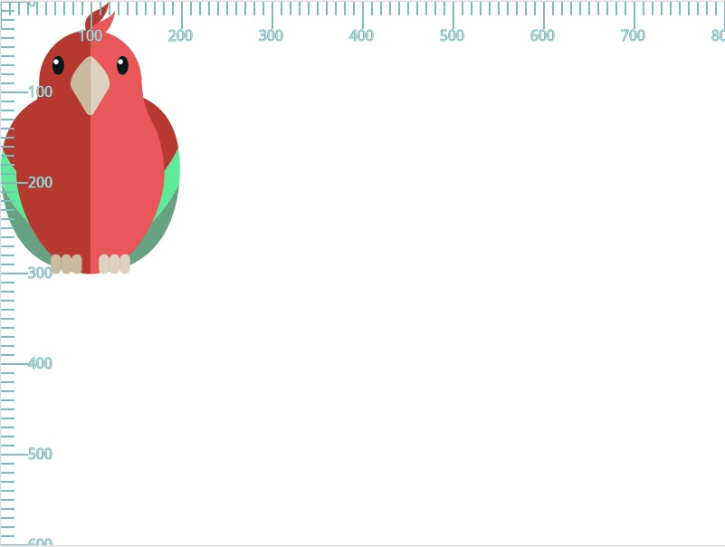
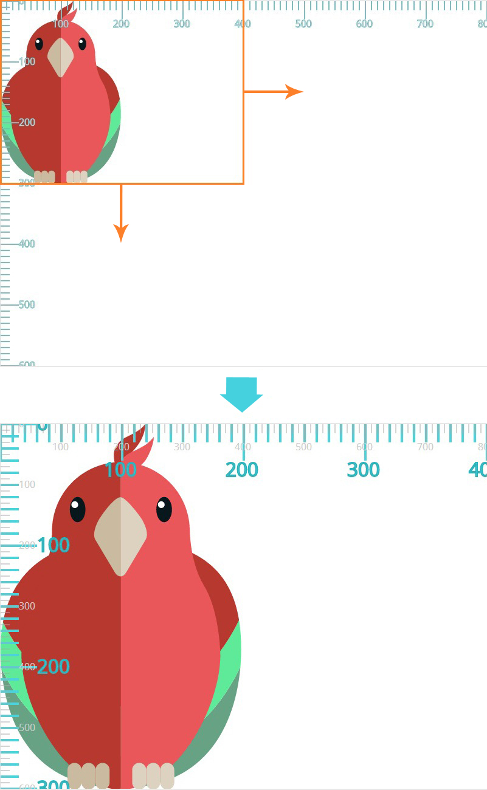
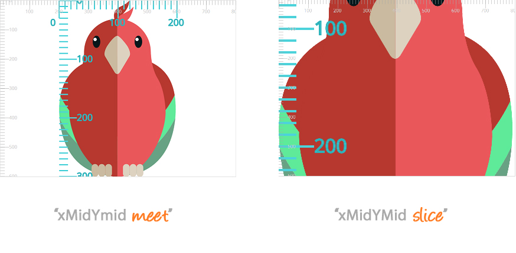

SVG元素不同于其它HTML元素，它不受CSS盒模型控制。这使得定位（`positiong`）和转换（`transforming`）SVG元素更加棘手，初看之下，看起来很不直观😅。但一旦你理解了 `SVG坐标系统` 和 `转换` 的工作原理，操作SVG将变得很简单，然后一切都能解释得通了😏。

本文将介绍控制SVG坐标系统的最重要3个特性（`attributes`）:

1. `viewport` - 视窗
2. `viewBox` - 图形真正所在的画布
3. `preserveAspectRadio` - 纵横比（`height/width`）是否保持以及是否完整显示viewBox画布内容

::: tip

为了便于演示 `viewBox` 和 `preserveAspectRatio` ，这里有一个在线交互的工具：

- [🔦 Svg Coordinate System Interactive Tool](https://www.sarasoueidan.com/demos/interactive-svg-coordinate-system/)

:::

这是理解SVG坐标系统3篇文章中的第一篇。


## 1️⃣ SVG画布

📚 画布（`Canvas`）是SVG绘制SVG内容的空间或者区域。从概念上讲，这个画布在水平和垂直方向是无限的，因此SVG可以是任意尺寸😎。但是，它是相对于一个称之为 **`视窗（viewport）`** 的 `有限区域` 在屏幕上被渲染的。而超出视窗边界区域的SVG将被裁切掉，且不可见。

::: tip

`viewBox` 所定义区域为画布区域；透过 `viewport` 去看画布区域。

画布区域可以进行transform操作，以便透过 `viewport` 看到不同的景象。

:::


## 2️⃣ 视窗（the viewport）

viewport是SVG可见的可视区域。`你可以把viewport理解想象为一扇窗，透过这扇窗你可以看到特定的场景😎` ，你可能透过这扇窗看到整个场景，也有可能看到场景的一部分🎉。

SVG视窗类似于浏览器的视窗。一个网页可能是任意尺寸；它可能宽于视窗的宽度，大多数情况是高于视窗的高度的。但是，透过浏览器的视窗，你只能看到网页的部分区域的内容。

是否整个SVG画布可见，还是只可见部分画布区域，取决于下面2个因素：

1. 该画布的尺寸（`size of that canvas`）
2. `preserveAspectRatio` 特性的值

📚 通过最外层的 `<svg>` 元素的 `width` & `height` 特性指定视窗（`viewport`）的尺寸：

```html {1}
<!-- SVG viewport的尺寸为 800px x 600px -->
<svg width="800" height="600">
  <!-- SVG内容绘制在SVG画布上 -->
</svg>
```

在SVG中，值可以带上单位，也可以不带单位。无单位值在会使用在 `用户空间（user space）` 中指定的 `用户单位（user units）`📚。如果以用户单位指定一个值，则假定该值等价于相同数量的 `px` 单位。这也意味着，上面示例中的视窗大小将为 `800px x 600px`。

::: tip

你也可以使用单位指定具体的值。SVG支持的长度单位有：`px` & `em` & `%` & `ex` & `pt | pc | cm | mm | in`

:::


👩‍🏫 一旦设置了最外层的SVG元素的宽高，则浏览器就会建立`2个初始坐标系统`🎉：

1. 初始视窗坐标系统（`initial viewport coordinate system`）
2. 初始用户坐标系统（`initial user coordinat system`）


### 2.1 初始坐标系统

1️⃣ 初始视窗坐标系统（`initial viewport coordinate system`）是建立在viewport上的一种坐标系统：(这个坐标系统类似于那些CSS盒模型的HTML元素建立的坐标系统)

- 它的原点在viewport左上角（`(0, 0)`）位置
- 正x轴指向右侧➡️，正y轴垂直向下⬇️
- 左边系统中的 `1单位` 相当于viewport中的 `1px`


2️⃣ 初始用户坐标系统（`initial user coordinate system`）时建立在 `SVG画布` 上的一种坐标系统：（也称之为 `current coordinate system` | `user space in use`）

- 它的原点在viewport左上角位置
- 正x轴指向右侧➡️，正y轴垂直向下⬇️
- 可通过 `viewBox` 特性对坐标系的原点位置，和宽高进行修改，使其和视窗坐标系统不一致

::: tip

如果不指定 `viewBox` 特性，用户坐标系统等同于视窗坐标系统

:::


下图中，视窗坐标系统尺子📏是 `灰色的`；用户坐标系统（`viewBox`）是 `蓝色的`。因为此时两个坐标系统是等同的，因此它们重叠了：



上图中的鹦鹉🦜宽度为 `200单位` （这里是 `200px`） 和 高度是 `300单位` （这里是 `300px`）。鹦鹉基于初始坐标系统绘制在画布（`canvas`）上。

::: tip 📚

还可以对容器元素或者图像元素使用 `transform` 特性定义 `transformations` 来建立一个新的用户空间（即 `新的当前用户坐标系统`）。我们将在后面文章讲解transformations😎。

:::


## 3️⃣ viewBox语法

`viewBox` 特性接收4个参数作为一个值：

```bash
viewBox = <min-x> <min-y> <width> <height>
```

- `<min-x> <min-y>` 决定viewbox的左上角位置
- `<width> <height>` 决定viewbox的宽高
  - 它们不需要和 `<svg width='xx' height='yy'>` 上的宽高一样
  - 不能为负数值
  - 值为 `0` 时，将不会渲染该元素

视窗（`viewport`）的宽度可以通过CSS设置，🌰

```css
svg {
  width: 100%;
}
```

这使得svg视窗随着窗口变化而变化，无论viewBox的值是多少，它都将被映射到外部SVG元素的计算宽度。

设置 `viewBox` 的示例：

```html
<!-- 这里的viewbox和viewort相同，但是它可以设置任意有效值 -->
<svg width="800" height="600" viewBox="0 0 800 600">
  <!-- SVG内容绘制在SVG画布上 -->
</svg>
```

如果你曾了解过 `viewBox`，你可能听过，通过它可以对SVG图形进行缩放或者转换。没错，甚至可以通过 `viewBox` 这个特性对图形进行裁切（`crop`）🚀。

理解 `viewBox` 最好的方式就是，通过可视化的方式将它和 `viewport` 进行区分。下面我们将看几个例子，先从 `aspect ratio 相同` 的例子开始，这样我们现在可以不必对 `preserveAspectRadio` 进行过多的研究。


### 3.1 viewBox纵横比 = viewport纵横比

🌰1️⃣ - `保持纵横比相同，只是进行裁切，放大用户坐标系操作`

 先看一个简单的例子，`这个例子中，viewBox是viewport尺寸的一半`。这里不改变viewBox的原点位置，即 `<min-x> <min-y>` 为 `"0 0"`。viewbox的宽高均为viewport的一半，这意味着它们的纵横比（`height/width`）是相同的：

```html
<svg width="800" height="600" viewBox="0 0 400 300">
  <!-- SVG内容绘制在SVG画布上 -->
</svg>
```

那么设置 `viewBox="0 0 400 300"` 会发生什么呢？

1. 它指定了画布区域，从左上角的 `(0,0)` 到 `(400,300)` 区域
2. SVG图形然后被 `裁切` 到该区域
3. 🎉 该区域将 **放大(`scaled up`)** 填充整个viewport
4. 📚 用户坐标系统将被映射到viewport坐标系统 - 这个例子 - `用户坐标系中的1单位相当于viewport坐标系统中的2单位`（相当于放大2倍😏）

下图展示了，将上面的 `viewBox` 应用到 `<svg>` 画布的过程：

- 灰色单位表示viewport坐标系统
- 蓝色表示通过 `viewBox` 创建的用户坐标系统




::: tip

指定一个viewBox的结果类似于将图形裁剪到该viewBox，然后将其放大，以便填充整个viewport区域。记住，在本例中我们仍然保持与viewport相同的纵横比(`sapect ratio`)。

你绘制在SVG画布上的任何图形都将相对于新的用户坐标系统进行绘制。

:::

我喜欢用 `viewBox` 可视化SVG画布，就好像Google地图一样。你可以在地图上缩放或者放大某个特定的区域；该区域将被放大，并只在浏览器viewport中可见。但是，地图的其余部分仍在那里，只不过受限于viewport的大小，暂时看不到而已 - 即它们被裁切到外面去了。


---

🌰2️⃣ - `保持宽高比率相同，裁切，放大用户坐标系后进行负方向平移操作`

 现在我们尝试改变 `<min-x> <min-y>` 为 `"100 100"`。它们可以是任意数值，viewBox的宽高比率仍和viewport宽高比率保持一致：

```html
<svg width="800" height="600" viewBox="100 100 200 150">
  <!-- SVG内容绘制在SVG画布上 -->
</svg>
```

设置 `viewBox="100 100 200 150"` 的效果和上个例子一样的裁切效果。📚**`图像先被裁切，然后放大填充整个viewport区域`**:


同样，用户坐标系映射为了viewport坐标系 - `200用户单位被映射为800viewport单位`（即1单位用户单位 = 4倍viewort单位），结果就是上图的放大效果。

::: tip

同样需要注意的是，这里使用了非0的 `<min-x> <min-y>` 值，对🦜产生了 `transformation` 效果。更具体的讲：这就好像SVG画布（即🦜所在的用户坐标系统）上平移了100个单元，向左平移了100个单元（`transform="translate(-100, -100)"`）😎

:::


📚实际上，正如规范所讲，viewBox属性的效果是，用户代理自动提供适当的转换矩阵，将用户空间中的指定矩形映射到指定区域(通常是 `viewport`)的边界。

这只是我们之前提到的说法的一种华丽的方式：**图像被裁切，然后放大去填充整个viewport**。规范之后还添加一个注解：

- 在某些情况，用户代理除了`scale transformation`（缩放转换）外，还需要提供一种 `translate transformation`(平移转换)
- 比如，在最外层svg元素上，当其 `viewBox` 特性的  `<min-x> <min-y>` 值不为 `0` 时，就需要进行 `平移转换`

---

🌰3️⃣ - `保持宽高比率相同，裁切，放大用户坐标系后进行正方向平移操作`

 为了更好的演示平移转换，我们尝试将 `<min-x> <min-y>` 值设置为 `-100 -100`。平移效果类似于 `transform="translate(100, 100)"`，即图像在裁切和放大后，将向下⬇️和向右➡️移动，具体svg代码：

```html
<svg width="800" height="600" viewBox="-100 -100 400 300">
  <!-- SVG内容绘制在SVG画布上 -->
</svg>
```


::: tip

1. 先裁切 -> 
2. 用户坐标系放大填充整个viewport坐标系 ->
3. 平移操作，因为放大了`2倍`，相当于 1用户单位 = 2viewport单位，所以平移 translate(100, 100) 用户单位 = translate(100 * 2, 100 * 2)viewport单位

:::

注意，与`transform` 特性不同的是，由于`viewBox`而创建的自动转换（`transformation`）不会影响具有viewBox属性的元素上的x、y、宽度和高度属性。因此，在上例中，显示了一个具有width、height和viewBox属性的svg元素，`width` 和 `height` 特性表示在应用viewBox转换之前存在的坐标系统中的值。**你可以在上面的示例中看到这一点，因为即使在`<svg>`上使用viewBox属性之后，初始(灰色)viewport坐标系仍然不受影响。😎**

📚另一方面，和 `transform` 特性一样，它为所有其它特性和后代元素建立了一个新的坐标系统。你还可以看到，在上子中，当建立的用户坐标系是一个`新的坐标系`时，它不再保持最初的用户坐标系（即使用viewBox之前的视口坐标系）。`<svg>`任何后代都将依据`新的`用户坐标系统进行定位和尺寸适配，而不是初始的用户坐标系统。


---

🌰4️⃣ - `保持宽高比率相同，裁切，缩小操作`

最后一个 `viewBox` 示例和上一个例子类似，我们将 **扩展** 它在viewport中的区域，看看它如何影响图形的，而不是对画布进行裁切😄。

- 我们将指定一个 `viewBox`，它的宽高 > viewport宽高，当然还是保持它们的宽高比一致（我们将在之后处理宽高比的问题）
- viewBox 是viewport的 `1.5倍`

```html
<svg width="800" height="600" viewBox="0 0 1200 900">
  <!-- SVG内容绘制在SVG画布上 -->
</svg>
```

现在所发生的是用户坐标系统将被放大到`1200x900`。它将被映射到viewport坐标系统，因此每1用户单位:

- 水平 `viewport-width / viewbox-width`
- 垂直 `viewport-height / viewbox-height`

这意味着，1单位用户x方向坐标系统 = 0.66单位viewport坐标同；同理y方向也是。

📚当然，还是通过可视化的方式来理解。viewBox被缩小，以便适应viewport坐标系统，得到一个新的用户坐标系统。因为图像（🦜）依据新的用户坐标系统绘制到画布上，而不是依据viewport坐标系统，所以它看着要比在viewport小（是其 `0.66` 倍）：


---

到目前为止，我们所有的例子都符合viewport的高宽比。但是，如果viewBox中指定的高度和宽度与视口的宽高比不同，会发生什么呢?例如，假设我们将`viewBox`的尺寸设置为`1000x500`。高宽比不再与viewport相同。在我们的例子中使用`viewBox = "0 0 1000 500"`的结果如下所示:


用户坐标系统和其图形定位到viewport坐标系统的过程：

1. 整个`viewBox`适配`viewport`
2. 📚 `viewBox` 的宽高比率得以保存，viewbox **`没有拉伸`** 以覆盖`viewport`区域
3. `viewbox` 同时在水平和垂直方向位于 `viewport` 中心

这是默认的行为。是什么控制了这种行为？如果我们想改变`viewbox`在`viewpprt`中的位置呢？这就是`preserveAspectRatio`属性的用武之地了😏。


## 4️⃣ `preserveAspectRatio` 特性

👩‍🏫 `preserveAspectRatio` 特性用于强制统一缩放，以保持图形的纵横比（`aspect radio`）。

如果我们定义的用户坐标系统的纵横比和viewport坐标系统纵横比不一致，如果浏览器像我们之前看到的那样`拉伸（stretch）` viewBox去适应viewport，纵横比差异会导致图形在某个方向上的扭曲（`distorted`）。

如果上面的例子中的viewBox(`viewBox="0 0 1000 500"`)同时在垂直水平方向去填充viewport，图形会看起来像下面这样被扭曲：`不保持纵横比，图形被扭曲，水平缩窄，垂直拉伸`


当使用 `viewBox="0 0 200 300"` 时，这种扭曲会更明显（当然，也不是我们想要的😅），此时用户坐标系统小于viewport尺寸。我特意挑选了 `200 300` 这组值，它和鹦鹉🦜的大小是一样的。如果浏览器拉伸图形填充整个viewport，它看起来会是这样的： `拉伸小的viewBox填充viewport`


::: tip 📚

`preserveAspectRatio` 特性允许你强制统一缩放viewbox的同时，并保持viewbox的纵横比，并且允许你指定viewbox在viewport中的`放置位置`（类似于 `background-position`），默认是居中（`background-position: 50% 50%` 效果）显示的。

:::


### 4.1 ⭐ preserveAspectRatio语法

官方语法：`它用于任何创建新 viewport 的元素` （🚨 注意是 `viewport` ）

```bash
preserveAspectRatio = defer ? <align> <meetOrSlice>?
```

📚 参数：

- `defer` 参数是可选的，它只用在你对 `<image>` 使用 `preserveAspectRatio` 时，用于其它元素会被忽略😁。（由于 `<image>` 不在本文的讨论范围内，因此本文跳过对 `defer` 的深入理解）
- `<align>` 参数表示是否强制统一缩放，如果使用了，只有在 `viewBox` 的纵横比与 `viewport` 的纵横比不相同时，才会使用对齐方法（`alignment method`） 🚀
  - 如果 `align` 设置为 `none`，即 `preserveAspectRatio = "none"`，图形会在不保持纵横比的情况下，填充整个 `viewport`，正如我们上面看到的例子一样
  - `align` 的其余值都会保持 `viewBox` 的纵横比，然后指定如何在viewport中对齐viewbox，类似于 `background-position` 😎
  - `align` 默认值为 `xMidYMid`，类似于 `background-position: center center` | `background-position: 50% 50%`
- `<meetOrSlice>` 参数是可选的，它默认值为 `meet`。这个参数表示整个 `viewBox` 是否在viewport中可见，它类似于 `background-size` 的效果
  - `meet` -> 类似于 `background-size: contain`
  - `slice` -> 类似于 `background-size: cover`
  - 如果使用，则它放在 `<align>` 参数后面，用空格间隔开，🌰 `preverseAspectRatio = "xMinyMin slice"`

::: tip 🚀

将 `align` 设置为 `none`，不会保持纵横比，粗暴拉伸缩放图形，填充整个viewport（在viewBox纵横比与viewport纵横比不一致的情况下，会导致图形扭曲）；后面的 `preserveAspectRatio` 在 `align = "none"` 的情况下，是没有效果的。`align` 必须为非 `none` 值时，`preserverAspectRatio` 才有意义😏。


这些参数初看之下很奇怪，为了便于理解，你可以把 `meetOrSlice` 理解为 `bacground-size` 的 `contain` & `cover` 值，它们的效果很相似😄

- `meet` - 保持纵横比的同时，它用于指定 `viewBox` 是否完全包容在viewport中
- `slice` -  保持纵横比的同时，尽可能的缩放以覆盖整个viewort区域，这也意味着部分viewBox将被裁切掉

:::


### 4.2 `meet`

`<meetOrSlice>` 参数的默认值。

📚 尽量缩放图形的同时，维持下面2个重要指标：

1. 保持图形纵横比（即不让图形出现扭曲现象）
2. 整个 `viewBox` 在viewport都可见，即 `background-size: contain` 效果

在这种情况下，如果图形的纵横比与viewport不匹配，一些viewport将超出`viewBox`的边界（viewBox将绘制的区域缩小，小于viewport，可查看上面2个例子）。这种情况，`viewBox` 的边界被包含在viewport中，即它们边界 `meet` 了😁。


### 4.3 `slice`

📚 缩放图形使viewport `覆盖（cover）` 整个viewport区域，同时保持纵横比，可理解为 `background-size: cover` 效果。viewBox被缩放到足以覆盖viewport区域(在两个维度上)，但它不会缩放到超出所需的范围

- 换句话讲，它被缩放到最小的尺寸，这样viewBox的宽度和高度可以完全覆盖viewport 🚀。假设图形的 `x` 方向需要放大 `3` 倍填充viewport的x方向，而其 `y` 方向要放大 `4` 倍，则它最终将放大 `4倍` 去 `cover` 整个viewport

在这种情况下，如果viewBox的纵横比与viewport不匹配，一些viewBox将超出viewport的边界（`即部分图形将不可见`），即viewBox的绘制区域将大于viewport，这势必导致部分viewBox被裁切掉📚。

::: tip

你可以将其理解为 `background-size: cover`。这种情况下，背景图在保持其固有纵横比的同时会被放大，直到背景图的宽和高都能完全覆盖背景区域位置为止。

:::


🌰 `viewBox = "0 0 200 300"` 的图形，在 `align` 为浏览器默认值（`xMidYMid`）的情况下，分别使用 `meet` 和 `slice` ，其效果如下：




默认情况下，`align` 为 `xMidYMid`，这里的图像都进行了放大，图形的中心轴和viewport的中心轴对齐。


### 4.4 `align`

`align` 参数可以接收 `9` 种值中的一种，或者 `none` 值：

- `xMin` & `xMid` & `xMax` 和 `yMin` & `yMid` & `yMax` 进行两两组合，得到 3 * 3 = 9种可能，它们都会在 **保持图形纵横比** 的前提下，对viewBox进行缩放
- 默认值是 `xMidYMid` 即 viewBox和viewport横纵中心轴都对齐
- `align: none`  不用保持纵横比，直接填充整个viewport，可能导致图形拉伸或缩放扭曲

::: tip

`align` 工作效果类似于使用了百分比的 `background-position` 。 你可以把 `viewBox` 看做是背景图（`background image`）。`align`与`background-position`的定位不同之处在于，它不是将viewBox的特定点定位在viewport的相应点上，`而是将viewBox的特定“轴”与viewport的相应“轴”对齐`😎。

:::

为了理解 `align` 的各种值，我们先介绍各种 **`轴（axes）`**。

还记得 `viewBox` 的 `<min-x>` & `<min-y>` 吗？我们将它用来定义viewBox的 `min-x` & `min-y` 轴。另外我们将定义2个 `max-x` & `max-y` 轴：

- `<max-x>` = `<min-x>` + `<width>`
- `<max-y>` = `<min-y>` + `<height>`

最后我们还需要2个中心轴 `mid-x` & `mid-y`：

- `<mid-x>` = `<min-x>` + `<width> / 2`
- `<mid-y>` = `<min-y>` + `<height> / 2`

🚀 这听起来是不是有点混乱😅，如果是的话，我们可以看一下下图，`viewBox="0 0 300 300"`，可以直到 `<min-x>` & `<min-y>` 均为 `0`：


上图灰色的虚线表示viewport的 `mid-x` & `mid-y` 轴。对于viewport，其 `min-x` 值等于 `0`，`min-y` 也等于 `0`；其 `max-x` 等于 viewBox的 `width`，`max-y` 等于 viewBox的 `height`。


下面详细介绍 `align` 的各个值：


#### 4.4.1 `none`

不强制统一缩放。如果需要，不均匀缩放给定元素的图形内容(不保留纵横比)，以便元素的边框与viewport矩形完全匹配。

换句话说，viewBox根据需要被拉伸或收缩，以便它完全填充整个视口，而不考虑长宽比。图片可能会失真。


::: warning

🚨 注意:如果align为`none`，则可选的`meetOrSlice`值将被忽略。

:::


#### 4.4.2 `xMinYMin`

强制统一缩放。


将元素`viewBox`的 `min-x` 与viewport的`最小X值`对齐，将元素`viewBox`的 `min-y` 与viewport的`最小Y值`对齐。


::: tip

将viewBox理解为背景图，将 `xMinYMin` 理解为 `background-position: 0% 0%`

:::


#### 4.4.3 `xMinYMid`

强制统一缩放。


将元素`viewBox`的 `min-x` 与viewport的`最小X值`对齐；将元素`viewBox`的 `中点Y值` 与viewport的`中点Y值`对齐。


::: tip

将viewBox理解为背景图，将 `xMinYMid` 理解为 `background-position: 0% 50%`

:::


#### 4.4.4 `xMinYMax`

强制统一缩放。


将元素`viewBox`的 `min-x` 与viewport的`最小X值`对齐；将元素`viewBox`的 `min-y + height` 与viewport的`最大Y值`对齐。


::: tip

将viewBox理解为背景图，将 `xMinYMid` 理解为 `background-position: 0% 100%`

:::


其余的类似，就不一一列举了，下面进行简短的说明：

- `xMidYMin`: 相当于 `background-position: 50% 0%` 
- `xMidYMid`: 相当于 `background-position: 50% 50%` 默认值😁
- `xMidYMax`: 相当于 `background-position: 50% 100%` 
- `xMaxYMin`: 相当于 `background-position: 100% 0%` 
- `xMaxYMid`: 相当于 `background-position: 100% 50%` 
- `xMaxYMax`: 相当于 `background-position: 100% 100%` 


### 4.5 preserveAspectRatio小结

因此，使用 `align` 和 `preserveAspectRatio` 的 `<meetOrSlice>` 值，你可以

- 是否缩放 `viewBox`
- 如何对齐viewport
- 是否整个viewBox在viewport中可见

有时，取决于 `viewBox` 的尺寸，有些值的效果是一样的。比如，`viewBox="0 0 200 300"` 的例子，某些 `align` 值的效果是一样的，我们将 `meetOrSlice` 的值设置为 `meet`，这样我们便能看到 `viewBox` 的全貌：

```html
<!-- 改变 align 的值 -->
<svg width="800" height="600" viewBox="0 0 200 300" preserveAspectRatio="xMaxYMax meet">
	<!-- SVG内容 -->
</svg>
```


::: tip

这里的例子可以看出，当为 `meet ` 时，整个viewaBox在viewport中都可见（`background-size: contain`）； viewBox的位置由 `x` 的位置决定。

:::


🌰 如果我们将 `meetOrSlice` 的值设置为 `slice`，这样viewBox将被拉伸，以便cover整个viewport，不同的值我们将得到不同的结果：

- x轴viewBox `200`单位拉伸到 viewport的 `800`单位；
- 为了维持纵横比的不变；viewBox的Y轴将被裁切掉部分😁


::: tip

这里的例子可以看出，当为 `slice ` 时，整个viewaBox都会被拉伸，只有部分区域在viewport中可见（`background-size: cover`）； viewBox的位置由 `y` 的位置决定。

:::


当然，不同于 `200x300` 的viewBox会看起来和这里的效果不一样。为了简洁性，我不会再给更多的例子。可以通过 [🔦 Svg Coordinate System Interactive Tool](https://www.sarasoueidan.com/demos/interactive-svg-coordinate-system/) 自己进行交互查看。


但是在继续之前，我想提醒的是，如果 `<min-x>` & `<min-y>` 的值发生了变化，`mid-x` & `mid-y` & `max-x` & `max-y` 的值也会发生变化。下面图片展示了 `viewBox="100 0 200 300"` ，可以发现 `min-x` & `mid-x` & `max-x` 的轴发生了变化：

```html {3-4}
<!-- 这里使用 preserveAspectRatio="xMidYMid meet" -->
<svg width="800" height="600" 
     viewBox="100 0 200 300" 
     preserveAspectRatio="xMidYMid meet"
>
	<!-- SVG内容 -->
</svg>
```


半透明的蓝色区域显示的是改变 ` min-x` 值后被认为是viewBox区域的区域。


## 5️⃣ 总结

希望通过本文，你能了解到：

1. 2种坐标系统：`初始viewport坐标系` & `初始用户坐标系统`
2. viewport坐标系统由最外层 `<svg>` 元素上的 `width & height` 决定
3. 在设置了 `viewBox` 之后，会创建一个新的 `用户坐标系统`；`viewBox` 存在4个值 `<min-x> <min-y> <width> <height>`
4. `preserveAspectRatio` 在viewport坐标系统和纵横比（`aspect ratio`） 不同于 用户坐标系统的纵横比时，对viewBox画布显示区域和大小有决定性作用
   1. 语法 `preserveAspectRatio="align meetOrSlice?"`
   2. 以下几种情况 `preserveAspectRatio` 是没有效果的
      - 没有指定 `viewBox` 
      - `viewBox` 的尺寸和 `viewport` 尺寸一致的时候
      - 有些 `preserveAspectRatio` 值设置后，对图形的影响就感觉没什么区别
   3. 如果 `align` 为 `none`，不用强制保持viewBox的纵横比，直接拉伸或缩放填充整个viewport坐标系统，很有可能对图形产生扭曲
   4. `align` 不为 `none` 的值（默认是 `xMidYMid`），都会强制保证viewBox的纵横比保持不变，可以将viewBox画布理解为 `background-image`，align的值则可以理解为 `background-position` 属性；但是viewBox的 `min-x min-y` 会对它们产生影响，这2个值类似于 `transform: translate(x, y)` 平移效果
   5. `meetOrSlice` 分别类似于 `background-size: contain` 和 `background-size: cover`；它决定viewBox画布是否在viewport中完全显示，还是部分显示


原文地址：

- [Understanding SVG Coordinate Systems and Transformations (Part 1) — The viewport, viewBox, and preserveAspectRatio](https://www.sarasoueidan.com/blog/svg-coordinate-systems/)


相关链接：

- [交互式工具 + preserveAspectRatio Recipes⚡](https://www.sarasoueidan.com/demos/interactive-svg-coordinate-system/)


2022年11月05日22:12:56